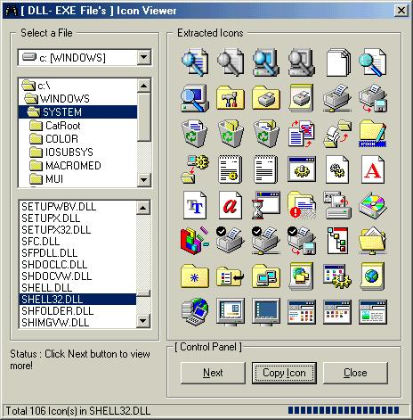

## A \.DLL and \.EXE file's Hidden Icon viewer and snapshot taker \(little bug fixed\)

### Description

Do you know shell32.dll (located in Windows\System\ folder) file has 106 ICONS? There are many files (EXE and DLL) has hidden Icons in your computer. DISCOVER hidden ICONS right now with this program. With this program you also find how to PRINT SCREEN of a SINGLE window (ALT + PrintScreen). I added sufficient comments with this project to help people understand source code properly. Please feel free to leave any comments or bug report.

Please Don&#8217;t Forget to VOTE me.

See the screen shot, which will tell you more!
 
### More Info
 

             |
---                |---
**Submitted On**   |2001-06-09 19:52:12
**By**             |[Mahatab\-ur\-Rashid](https://github.com/Planet-Source-Code/PSCIndex/blob/master/ByAuthor/mahatab-ur-rashid.md)
**Level**          |Intermediate
**User Rating**    |4.7 (33 globes from 7 users)
**Compatibility**  |VB 4\.0 \(32\-bit\), VB 5\.0, VB 6\.0
**Category**       |[Complete Applications](https://github.com/Planet-Source-Code/PSCIndex/blob/master/ByCategory/complete-applications__1-27.md)
**World**          |[Visual Basic](https://github.com/Planet-Source-Code/PSCIndex/blob/master/ByWorld/visual-basic.md)
**Archive File**   |[A \_DLL and212256162001\.zip](https://github.com/Planet-Source-Code/mahatab-ur-rashid-a-dll-and-exe-file-s-hidden-icon-viewer-and-snapshot-taker-little-bug-fi__1-24139/archive/master.zip)

